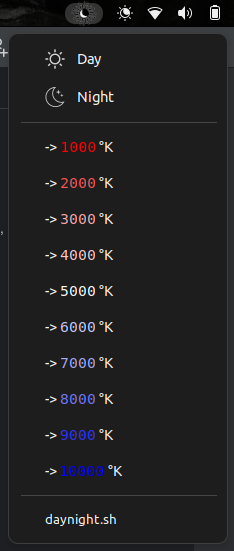

# Day-Night-Switcher

# Abstract
This is a tiny gnome / argos extension to switch between day and night display light. 
Day ~ 4700°K, Night ~ 1800°K. It's also possible to switch between 1000°K, 2000°K 
... 10000°K display color temperatures.

# Prerequisites
1) On Ubuntu, enable Night Light: `Settings->Displays->Night Light->(enable)`
2) Argos Installed (https://github.com/p-e-w/argos/)

# Installation
1) `git clone https://github.com/X0R0X/day-night-switcher.git`
2) `cd day-night-switcher`
3) `mkdir ~/.config/argos` (if it doesn't exist already)
4) `ln -s $(pwd)/daynight.sh ~/.config/argos/`